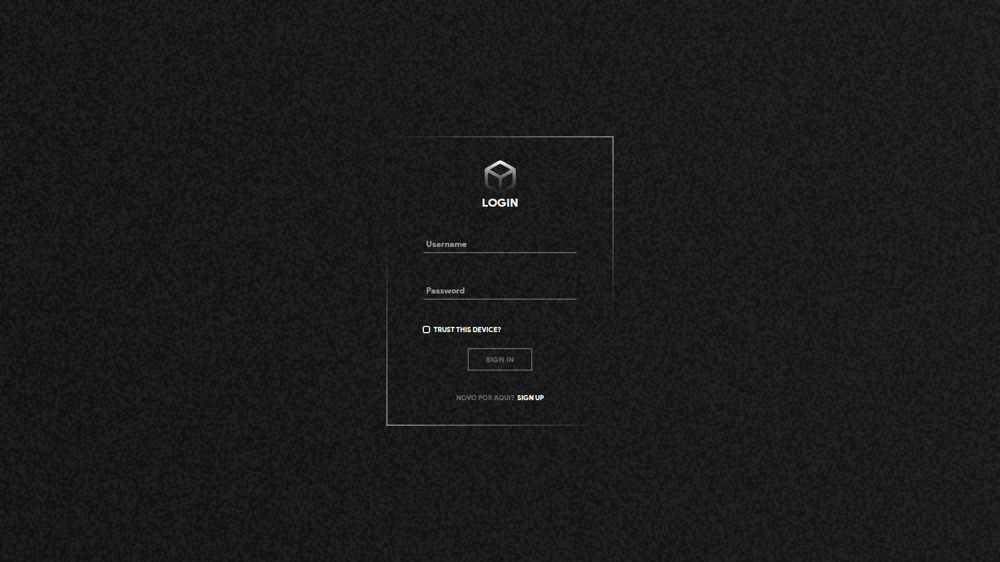
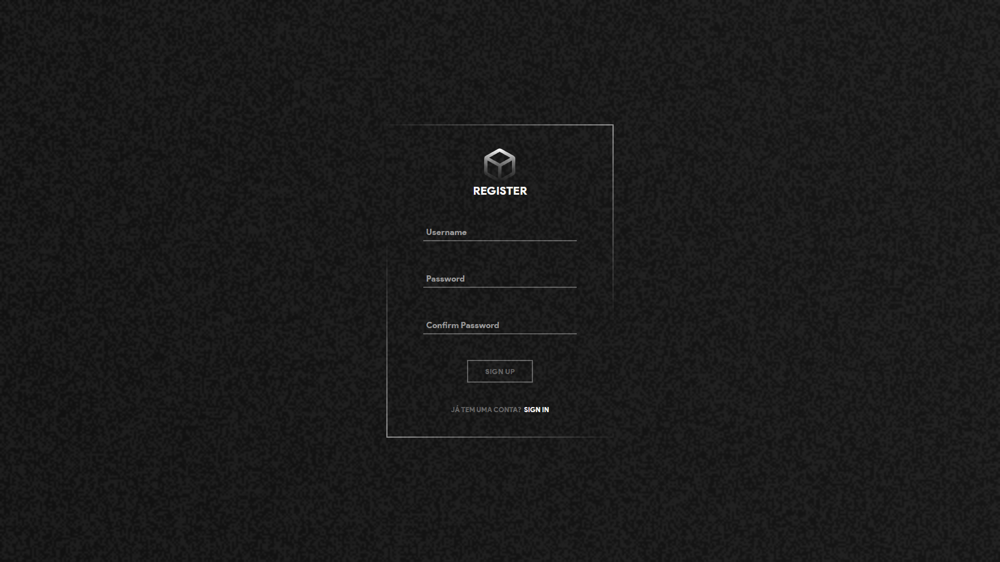
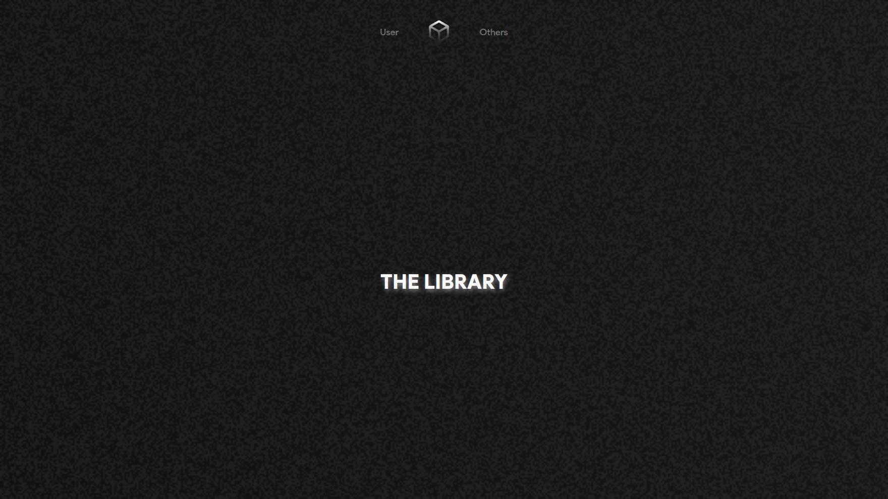
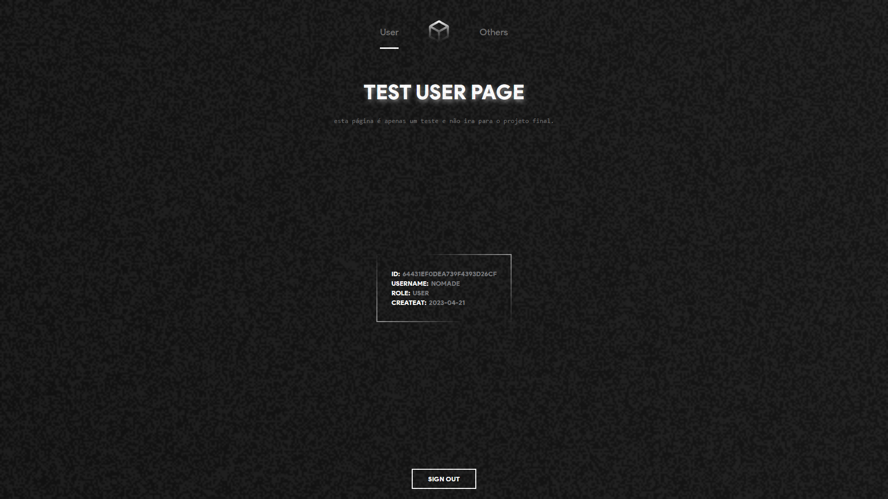
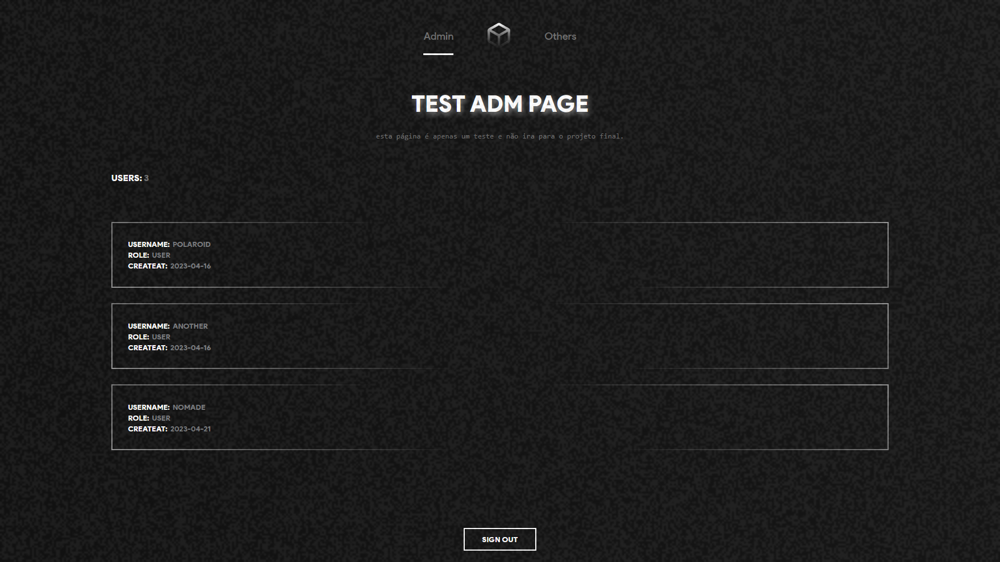

<h2 align="center">
   Login and Register Demo
</h2>

  <a href="#-aviso">Aviso</a>&nbsp;&nbsp;&nbsp;|&nbsp;&nbsp;&nbsp;
  <a href="#-projeto">Projeto</a>&nbsp;&nbsp;&nbsp;|&nbsp;&nbsp;&nbsp;
  <a href="#-tecnologias">Tecnologias</a>&nbsp;&nbsp;&nbsp;|&nbsp;&nbsp;&nbsp;
  <a href="#-Design">Desgin</a>&nbsp;&nbsp;&nbsp;|&nbsp;&nbsp;&nbsp;
  <a href="#-Demo">Demo</a>&nbsp;&nbsp;&nbsp;|&nbsp;&nbsp;&nbsp;
  <a href="#-licença">Licença</a>

## 📑 Aviso 
Este pequeno projeto é apenas uma pequena demo e teste, para um outro projeto que ando trabalhando, por esse mesmo motivo, não irei instruir como rodar o mesmo, outro motivo tambem seria que a API usada nele ainda está sendo desenvolvida. 

## 💻 Projeto

Este projeto foi pensando e construído pensando em como criar validações e autenticações de usuário, visando a ideia básica de uma tela de "login" ou de "register", tambem usei a oportunidade para fazer rotas privadas baseada nos dados fornecidos no "login", ele contém as seguintes funcionalidades: 

- [x] Registrar um novo usuário e apontar possíveis erros durante o registro.
- [x] Autenticar o usuário e apontar possíveis erros no "login".
- [x] Rotas privadas que só podem ser acessadas se o usuário estiver validado.

**extra:** 

- [x] uma pagina chamada "admin" que pega todos os usuários e mostra na tela (precisa estar validado como "admin" para acessar).
- [x] uma página de usuário simples para testar o "fetch" de informações baseado na autenticação.

### 📸 Imagens

**Login**

**Register**

**Home**

**User**

**Admin**

## 🚀 Tecnologias

Esse projeto foi desenvolvido com as seguintes tecnologias:

- [ReactJS](https://pt-br.reactjs.org)
- [Axios](https://axios-http.com/ptbr/)
- [ReactRouter](https://reactrouter.com)
- [TypewriterJS](https://github.com/tameemsafi/typewriterjs#readme)
- [FramerMotion](https://www.framer.com/motion/)
- [GlitchedWriter](https://github.com/thetarnav/glitched-writer)
- [ReactHookForm](https://react-hook-form.com)
- [ReactQuery](https://tanstack.com/query/v3/)
- [StyledComponents](https://styled-components.com/docs)
- [Zod](https://zod.dev)

## 🔖 Design

uma pequena parte dos efeitos e design foi baseado nesse site: [makemepulse](https://2016.makemepulse.com)

## 🎮 Demo 

Caso tenha ficado interresado você pode acessar a versão demo desse projeto [clicando aqui.](https://login-and-register-test.netlify.app/)

### contas para acessar o site:
- **conta do admin:**  
**_username:_** admin  
**_password:_** admin

- **conta de usuário:**  
**_username:_** nomade  
**_password:_** nomade

> você é livre para criar outra conta se quiser

## 📝 Licença

Esse projeto está sob a licença MIT. Veja o arquivo [LICENSE](LICENSE) para mais detalhes.